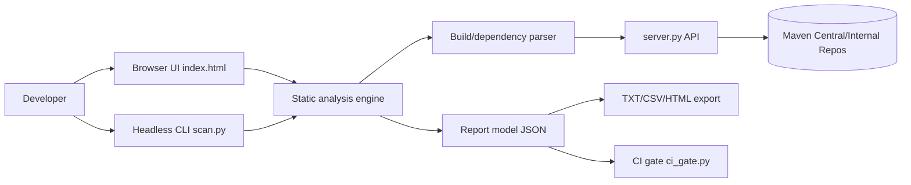

# Java Upgrade Helper Architecture

## System overview

## Main components

- **`index.html`**: UI, local file loading, analysis orchestration, rendering, and export.
- **`server.py`**: dependency lookup + Maven model resolution (parents, BOMs, properties).
- **`scan.py`**: headless scanner for CI/automation using same backend dependency logic.
- **`ci_gate.py`**: threshold gate for report JSON in pipelines.

## Data flow

1. Collect analyzable files (`.java`, `pom.xml`, `build.gradle*`, `application.*`).
2. Run static migration rules and framework matrix checks.
3. Resolve dependencies (direct + optional 1-hop transitive).
4. Compute internal artifact coverage.
5. Build unified report object and export in selected format(s).

## Boundaries and assumptions

- Static checks are heuristic/regex based for speed.
- Dependency accuracy is highest when full repo build files are present.
- Internal artifact classification uses prefixes + heuristics.
